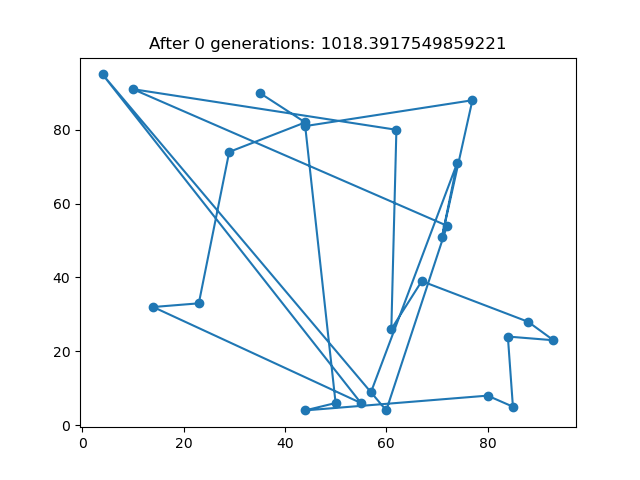
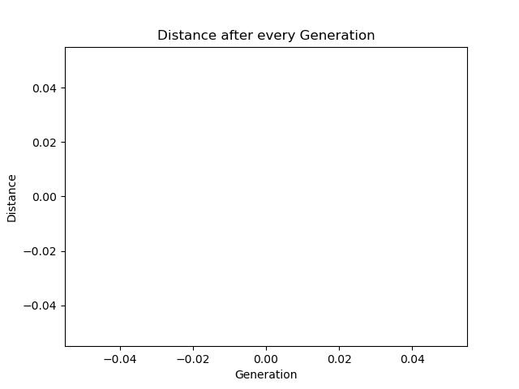

# Travelling Salesman Problem
The goal is to find the short est route for a salesperson to take in visiting N cities. Randomly placing the 25 cities in a 100 × 100 square doesn’t have an obvious minimum path. Implement GA to optimize the solution.

# Genetic Algorithm
| Graph                     | Distance                     |
|---------------------------|------------------------------|
|  |  |
